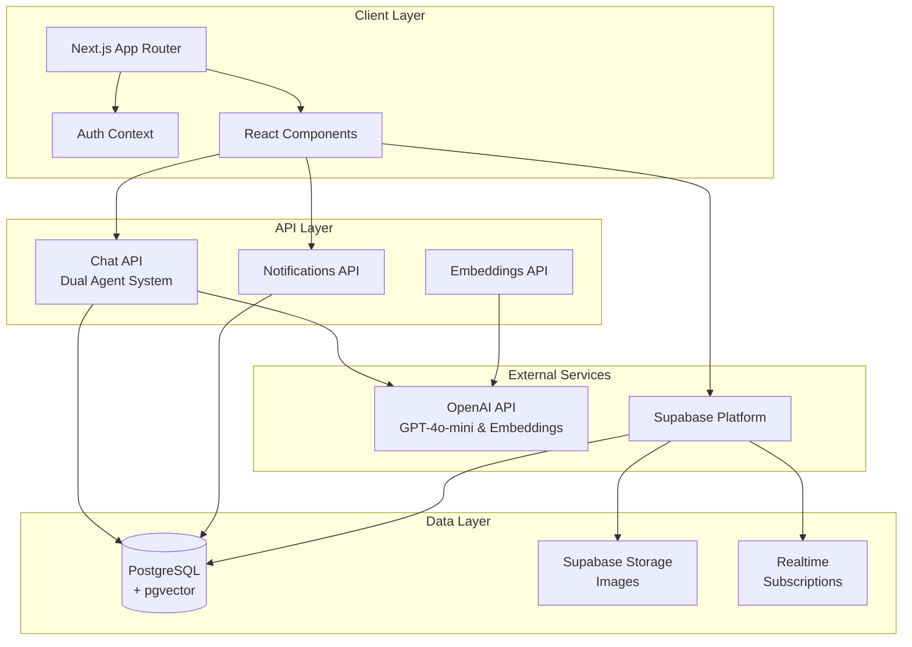
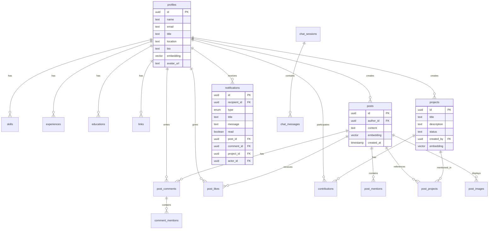
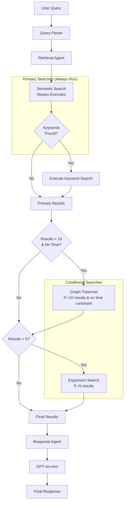

# Nural-app Architecture Documentation

This document provides a comprehensive overview of the Nural-app architecture, focusing on three critical aspects: system architecture, database schema, and the AI-powered chat system.

## 1. High-Level System Architecture

### System Architecture Explanation

The Nural-app follows a modern, layered architecture designed for scalability and maintainability:

#### **Client Layer**
- **Next.js App Router**: The foundation of the application, using Next.js 15.3.3's App Router for file-based routing and server-side rendering capabilities. This provides optimal performance with automatic code splitting and route prefetching.
- **Auth Context**: A React Context that manages authentication state globally across the application. It wraps the entire app and provides user session data, authentication methods (signIn, signUp, signOut), and profile completion status.
- **React Components**: The UI is built with TypeScript React components organized into three categories:
  - `ui/`: Reusable presentational components (MentionInput, SourceCard, etc.)
  - `features/`: Domain-specific components with business logic (PostCard, ProfileCard, etc.)
  - `layout/`: Structural components (Navbar)

#### **API Layer**
- **Chat API with Dual Agent System**: The most sophisticated API endpoint that implements a two-agent architecture:
  - **Retrieval Agent**: Analyzes queries and executes intelligent search strategies
  - **Response Agent**: Synthesizes search results into coherent, contextual responses
- **Embeddings API**: Generates vector embeddings using OpenAI's text-embedding-3-small model (1536 dimensions) for semantic search capabilities
- **Notifications API**: Handles fetching and marking notifications as read, supporting real-time notification features

#### **External Services**
- **OpenAI API**: Powers two critical features:
  - GPT-4o-mini for intelligent response generation in the chat system
  - text-embedding-3-small for creating semantic embeddings of all content
- **Supabase Platform**: Provides a complete backend-as-a-service:
  - Authentication with email/password support
  - Direct PostgreSQL database access
  - Real-time subscriptions for live updates
  - File storage for images and avatars

#### **Data Layer**
- **PostgreSQL with pgvector**: The primary database enhanced with vector search capabilities:
  - pgvector extension enables similarity search on embeddings
  - Row Level Security (RLS) policies ensure data access control
  - Optimized indexes for both traditional and vector queries
- **Supabase Storage**: Object storage for user-generated content:
  - Three buckets: avatars, post-images, project-images
  - Public read access with owner-only write permissions
- **Realtime Subscriptions**: WebSocket connections for live features:
  - Activity feed updates
  - New notifications
  - Comment additions

## 2. Database Schema & Relationships

### Database Schema Explanation

The database is designed around three core entities with rich relationships and semantic search capabilities:

#### **Core Entities**

##### **Profiles Table**
The central entity representing users in the system:
- **Primary Fields**: id, name, email, title, location, bio
- **Vector Embedding**: Stores a 1536-dimensional vector combining all profile information for semantic search
- **avatar_url**: Reference to profile image in Supabase Storage
- **Relationships**: One-to-many with skills, experiences, educations, links, posts, and notifications

##### **Posts Table**
User-generated content with social features:
- **Content**: Rich text that can include @mentions for people and projects
- **Vector Embedding**: Enables semantic search across all posts
- **author_id**: Foreign key linking to the profile that created the post
- **Timestamps**: created_at and updated_at for temporal queries

##### **Projects Table**
Organizational initiatives that people work on:
- **Metadata**: title, description, and status (active/paused/complete)
- **Vector Embedding**: Allows finding similar or related projects
- **created_by**: Links to the profile who initiated the project

#### **Supporting Tables**

##### **Skills, Experiences, Educations**
Profile enrichment data:
- **Skills**: Simple skill tags linked to profiles
- **Experiences**: Work history with company, role, dates, and descriptions
- **Educations**: Academic background with school, degree, and year

##### **Social Features**
- **post_likes**: Tracks which users liked which posts (with unique constraint)
- **post_comments**: Threaded discussions on posts
- **post_images**: Multiple image attachments per post

##### **Mention System**
- **post_mentions**: Junction table linking posts to mentioned profiles
- **post_projects**: Junction table linking posts to mentioned projects
- **comment_mentions**: Tracks @mentions within comments

##### **Notifications**
Comprehensive notification system:
- **Types**: post_mention, comment_mention, comment_on_post, project_mention, project_added_as_contributor
- **Context Fields**: Links to relevant post, comment, project, and actor
- **Read Status**: Tracks whether user has seen the notification

##### **Chat System**
- **chat_sessions**: Groups messages into conversations
- **chat_messages**: Individual messages with metadata about mentions and sources

#### **Key Design Decisions**

1. **Vector Embeddings**: Three tables (profiles, posts, projects) store embeddings for semantic search
2. **Junction Tables**: Clean many-to-many relationships without data duplication
3. **Soft References**: Notifications use nullable foreign keys for flexibility
4. **UUID Primary Keys**: Globally unique identifiers for all entities
5. **Row Level Security**: All tables have RLS policies for secure data access

## 3. AI-Powered Chat System Architecture

### Chat System Explanation

The chat system implements a sophisticated dual-agent architecture with conditional search strategies optimized for both comprehensive results and fast response times (~2-3 seconds).

#### **Query Processing Pipeline**

##### **1. Query Parser**
Analyzes the user's natural language query to extract:
- **Intent**: The type of query (informational, analytical, exploratory, etc.)
- **Entities**: People, skills, projects, locations, and other domain-specific terms
- **Keywords**: Meaningful search terms after stop word removal
- **Time Constraints**: Temporal filters like "last week", "past month", "recently"
- **Mentions**: Direct @mentions of people or projects

##### **2. Retrieval Agent**
Orchestrates the search process with intelligent strategy selection:

**Primary Searches (Always Execute):**
- **Semantic Search**: 
  - Always runs first as the fastest and most effective strategy
  - Uses OpenAI embeddings to find semantically similar content
  - Searches across profiles, posts, and projects simultaneously
  - Limited to 30 results for optimal performance
  
- **Keyword Search**:
  - Executes only if meaningful keywords are extracted from the query
  - Uses pattern matching and fuzzy search with PostgreSQL's ILIKE
  - Expands terms (e.g., "ML" → "machine learning")
  - Groups results to prevent duplicates

**Conditional Searches:**
- **Graph Traversal**:
  - Triggers when primary searches return between 1-10 results
  - Skipped for time-based queries (e.g., "what happened last week")
  - Limited to depth 1 to maintain fast response times
  - Explores relationships: Profile → Posts → Mentions, Profile → Projects → Contributors
  - Uses only top 5 results as seeds to prevent combinatorial explosion

- **Expansion Search**:
  - Activates when very few results are found (less than 5)
  - Uses pattern-based term expansion without AI calls for speed
  - Examples: "front-end" → "frontend", "frontend", "front end"
  - Limited to 5 expansion terms maximum

##### **3. Response Agent**
Synthesizes the search results into an intelligent response:
- **Result Evaluation**: Assesses the quality and relevance of search results
- **Gap Identification**: Recognizes what information might be missing
- **Response Generation**: Uses GPT-4o-mini to create contextual, helpful responses
- **Source Attribution**: Extracts and formats the most relevant sources
- **Follow-up Suggestions**: Provides helpful next questions when results are limited

#### **Performance Optimizations**

1. **Conditional Execution**: Not all strategies run for every query
2. **Result Limits**: Capped at 30-50 items per search for manageable payloads
3. **Parallel Execution**: Multiple searches can run concurrently within each phase
4. **Early Termination**: Stops searching when sufficient results are found
5. **No AI for Expansion**: Pattern-based expansion avoids expensive API calls
6. **Deduplication**: Removes duplicate results across different search strategies

#### **Example Query Flows**

**"Who knows React?"**
1. Semantic search finds profiles with React in bio/skills (fast)
2. Keyword search finds additional matches in posts
3. Sufficient results found, graph traversal skipped
4. Response generated with list of React experts

**"What did the engineering team work on last month?"**
1. Semantic search with time constraints
2. Keyword search for "engineering team"
3. Graph traversal skipped (time-based query)
4. Response summarizes recent engineering activities

**"Find experts in quantum computing and their connections"**
1. Semantic search finds limited results
2. Keyword search adds a few more
3. Graph traversal explores connections of found experts
4. Expansion search might run if still few results
5. Response shows experts and their collaborative network

This architecture balances comprehensive information retrieval with the need for fast, responsive user experiences in an enterprise knowledge discovery context.